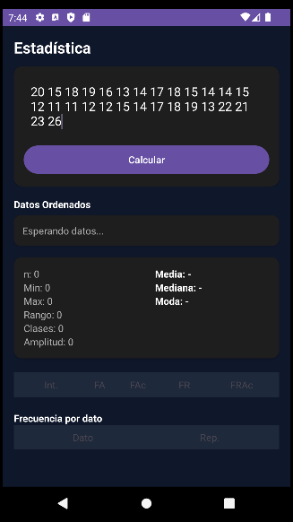
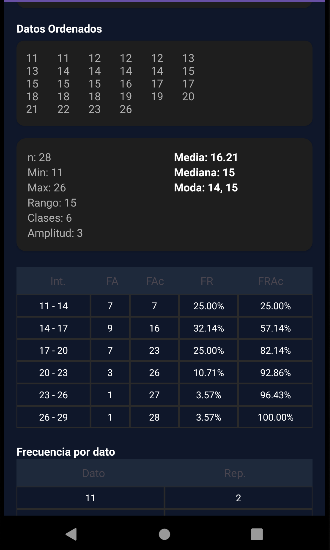

# 📊 Tablas de Frecuencia - Android App

Proyecto de **Ingeniería de Software** enfocado en el procesamiento de datos estadísticos. La aplicación aplica lógica matemática para el análisis descriptivo bimodal y ordenamiento de datos.

## 🚀 Funcionalidades Principales
* **Ordenamiento Automático:** Clasificación de menor a mayor al ingresar los datos.
* **Cálculos Estadísticos:** Media , Mediana y Moda.
* **Distribución de Frecuencias:** Cálculo de FA, FAc, FR% y FRAc% por intervalos.

## 📸 Demostración del Funcionamiento

| Ingreso de Datos | Resultados Obtenidos |
| :---: | :---: |
|  |  |

---

## 🛠️ Herramientas y Tecnologías
* **Entorno de Desarrollo:** Android Studio.
* **Lenguaje de Programación:** Java y XML para el Layout.
* **Control de Versiones:** Git y GitHub.
* **Documentación Técnica:** Markdown y VS Code.

## 👤 Autor
* **Randhal Arias** - Estudiante de Ingeniería de Software con IA.
* **GitHub:** [ViCaptum](https://github.com/ViCaptum)

## 📥 Descarga y Versiones
* [**Descargar última versión (APK)**](https://github.com/ViCaptum/Tablas_frecuencia/releases/tag/v1.0)
* [**Ver historial de lanzamientos (Releases)**](https://github.com/ViCaptum/Tablas_frecuencia/releases)